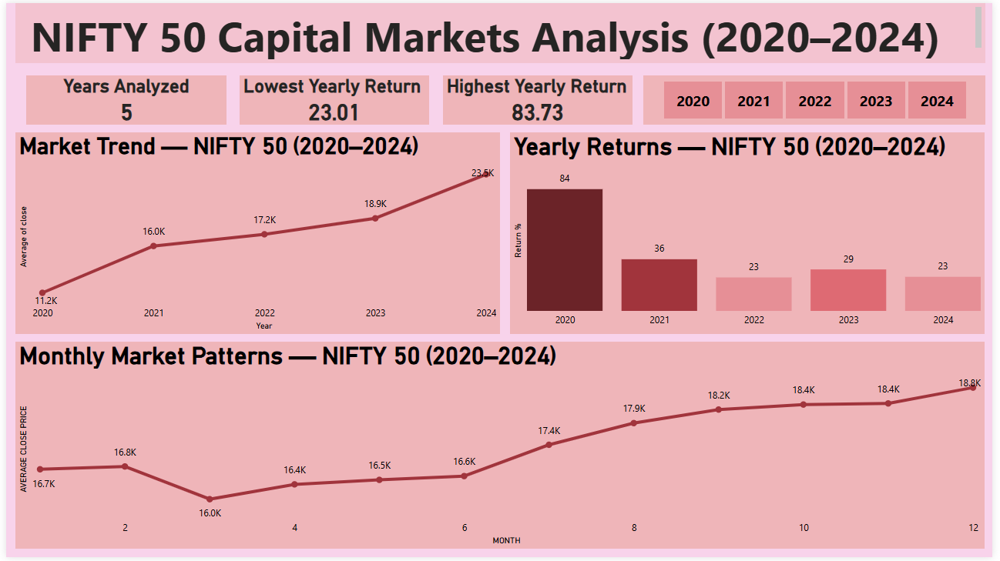

# NIFTY 50 Capital Markets Analysis (2020–2024)

## Project Overview
Analysis of 5 years of NIFTY 50 market data to identify yearly returns, 
monthly patterns and overall market direction using PostgreSQL and Power BI.

## Objectives
Analyze how the Indian stock market has behaved across different time 
periods — yearly, quarterly and monthly — to identify patterns, cycles 
and overall market direction.

## Business Questions
- Which year was the best and worst for the Indian market?
- Are there months where the market consistently goes up or down?
- What is the overall market direction — Bull or Bear?

## Key Findings
- 2020 was the best year with 83.73% return (COVID crash + recovery)
- 2022 was the weakest year with 23.01% return (global inflation + FII selloff)
- March is consistently the weakest month
- December is consistently the strongest month
- Overall verdict: Clear Bull Market — NIFTY 50 doubled from 12,182 to 26,000

## Tools Used
- PostgreSQL — data storage, cleaning and analysis
- Power BI — interactive dashboard and visualization
- Data Source — NSE India (niftyindices.com)

## Dashboard Preview

## Files
| File | Description |
|---|---|
| `nifty50_queries.sql` | All SQL queries used in the project |
| `NIFTY50_Dashboard.pdf` | Power BI dashboard export |
| `dashboard_screenshot.png` | Dashboard preview |
